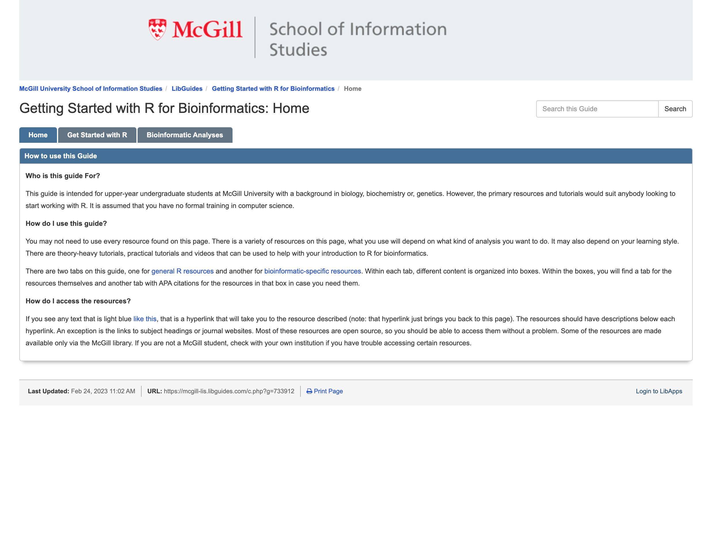
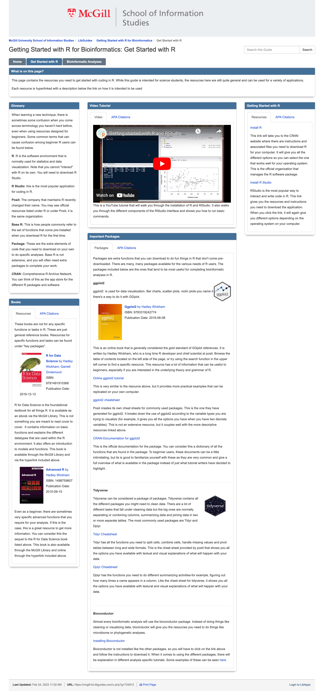
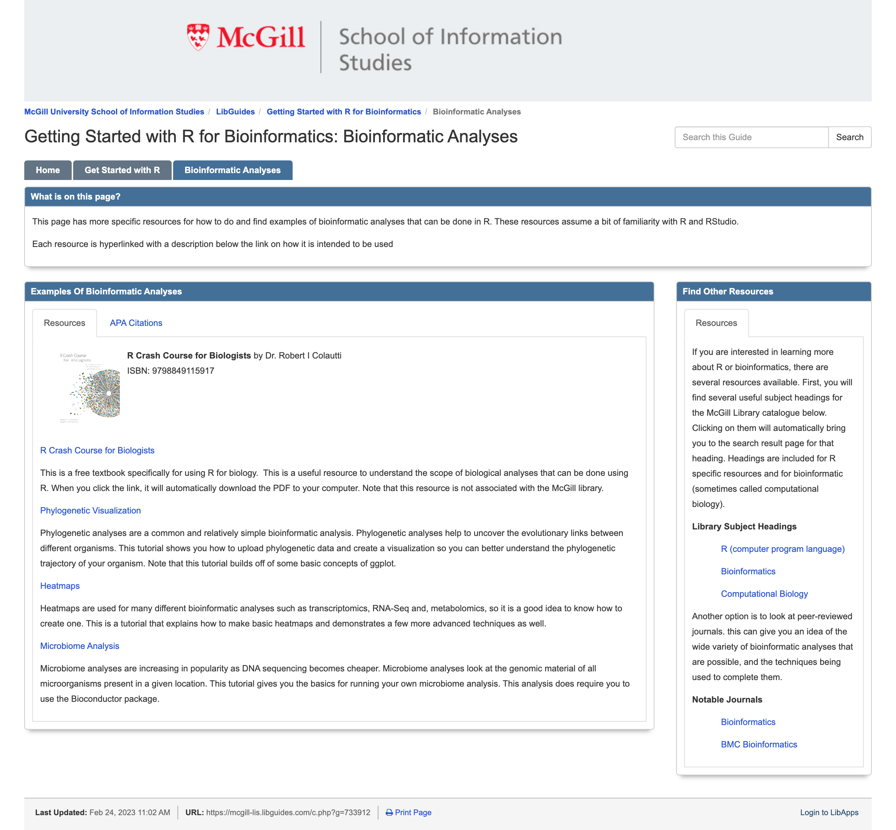

This is an example of a LibGuide that I made for my Reference and Information Services class at McGill during the Winter 2022 semester. Since the libguides get removed at the end of the academic year, I have preserved the images of each page in the repo. 

